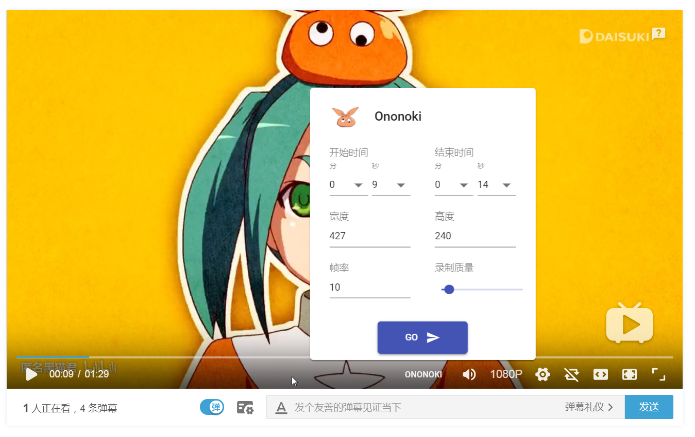
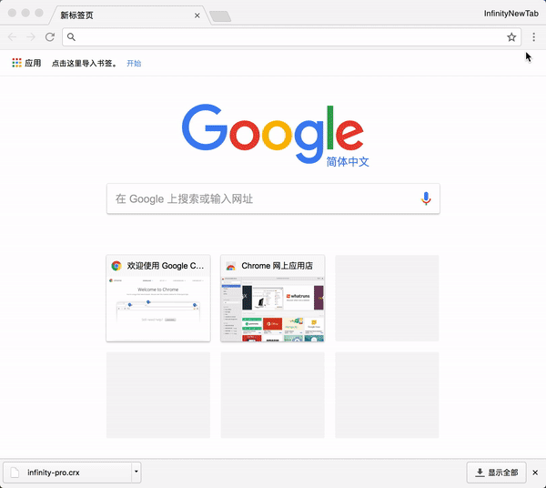

# [Ononoki](https://zh.moegirl.org/zh-hans/%E6%96%A7%E4%B9%83%E6%9C%A8%E4%BD%99%E6%8E%A5)

GIF 表情包生成器 chrome 扩展，目前支持 Bilibili。

## 功能预览

### 配置面板

### 预览 GIF

- 基于 [Web Workers](https://developer.mozilla.org/zh-CN/docs/Web/API/Web_Workers_API/Using_web_workers) 支持多线程并发编码 GIF
- 时长、宽高、帧率和质量精细控制
- 实时预览生成的 GIF

## 安装

### 在线安装（推荐）

[Chrome 商店](https://chrome.google.com/webstore/detail/meme-maker/hlalndcfbinfampnholjnkcaimdgnfae)

### 离线安装

下载 [crx 文件](./main.crx)，打开 chrome 扩展页面，把 crx 文件拖进去即可。

可参考下面的动图

>> 较新的 Chrome 不能直接导入 crx，请参考 [开发者模式导入解压文件](https://jingyan.baidu.com/article/f71d6037c581c91ab641d120.html)

## 计划表

- ~~生成的 GIF 实时预览~~
- 增加百毫秒时间定位输入栏
  - 考虑增加百毫秒级前进后退定位控制按钮
- 支持速率调节（多倍快速、慢速）
- 支持 [爱奇艺](http://www.iqiyi.com)
- 支持 Twitter
- 支持 Youtube
- 支持添加文字到 GIF 中
  - 初期只支持固定文字
  - 文字默认只有用户已安装的字体，后续可以考虑第三方字体
  - 二期支持动态文字
- 视频原始帧截图
- 修复全屏配置面板未显示的问题

## 贡献者

<table>
  <tbody>
    <tr>
      <td align="center" valign="top">
        
         
        <a href="https://github.com/devrsi0n">devrsi0n</a>
         
        
代码实现、创意

        <a href="https://weibo.com/p/1005052398438325">微博</a>
      </td>
      <td align="center" valign="top">
        
         
        <a href="https://weibo.com/u/1935400180">一闪一闪海星星</a>
         
        
Logo、项目名、创意

        <a href="https://weibo.com/u/1935400180">微博</a>
         
      </td>
     </tr>
  </tbody>
</table>
