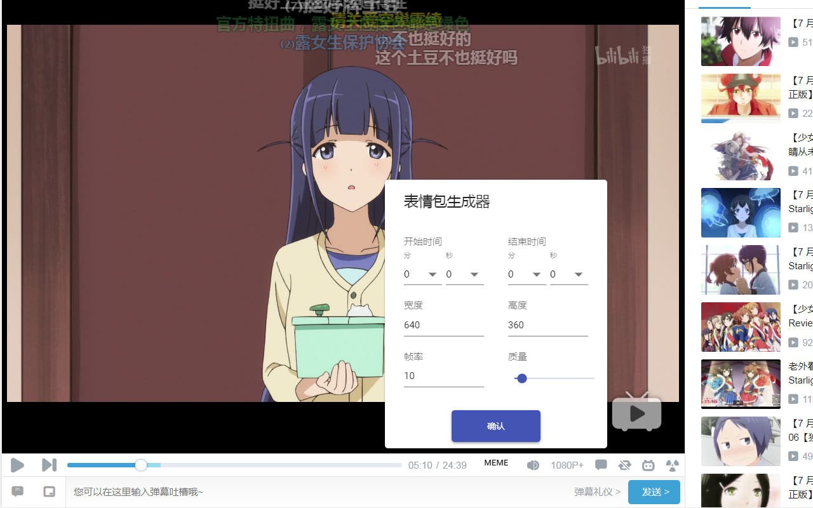

# meme-maker

GIF 表情包生成器 chrome 扩展，目前支持 Bilibili。

## 预览

## 安装

### 在线安装（推荐）

[Chrome 商店](https://chrome.google.com/webstore/detail/meme-maker/hlalndcfbinfampnholjnkcaimdgnfae)

### 离线安装（chrome 68 已失效）

下载 [crx 文件](./dist.crx)，打开 chrome 扩展页面，把 crx 文件拖进去即可。

可参考下面的动图

## TODO

- 生成的 GIF 实时预览
- 支持[爱奇艺](http://www.iqiyi.com)
- 支持添加文字到 GIF 中
  - 初期只支持固定文字
  - 文字默认只有用户已安装的字体，后续可以考虑第三方字体
  - 二期支持动态文字
- 视频原始帧截图
